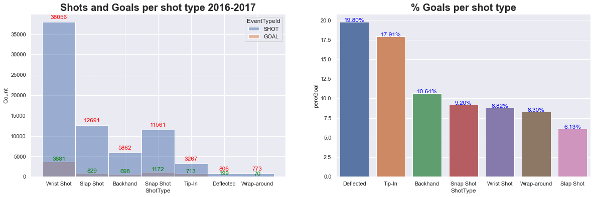
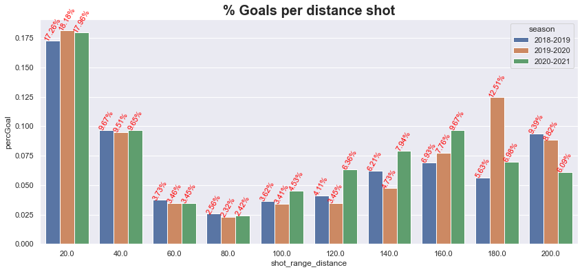
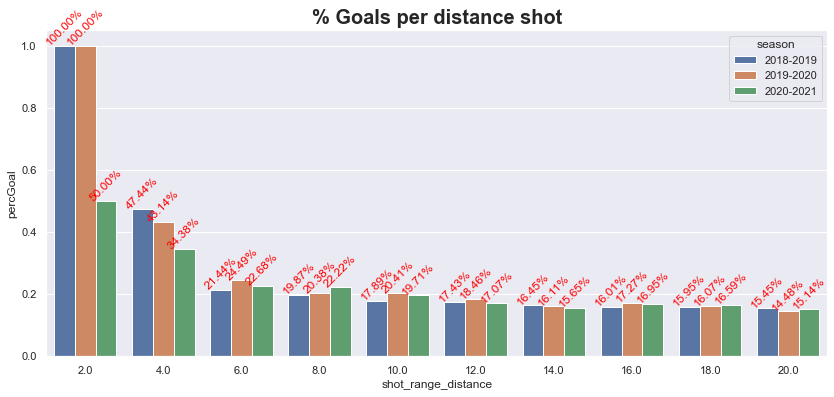
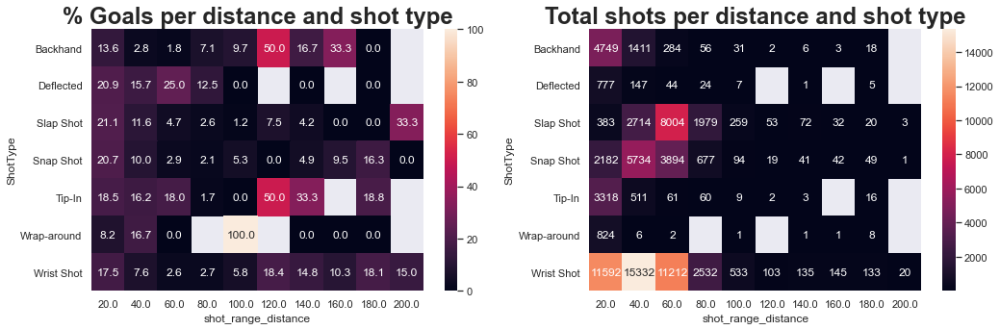
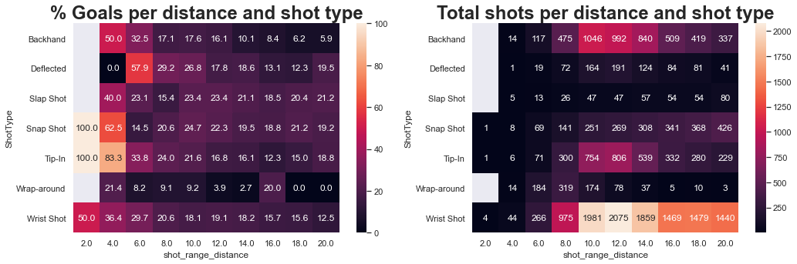

# Question 1: Warm-up

## 1
[
* which is the ratio of their shots saved over the total number of shots they faced
* What issues do you notice by using this metric to rank goalies?
* What could be done to deal with this?
]

## 2

[Filter out the goalies using your proposed approach above, and produce a bar plot with player names on the y-axis and save percentage (‘SV%’) on the x-axis]

## 3

[Discuss what other features could potentially be useful in determining a goalie’s performance]

# Question 2: Data Acquisition

[Write a brief tutorial on how your team downloaded the dataset.]

To download the NHL dataset, we have opted to save every season in its own file to simplify things.

### 1: Enumerating the game types
First things first, since there are a couple of game types recurring every season, we want to be sure to download
exactly what we want.
Each game type has its own unique code that is used to tell the server which type of game we want.
We first start by enumerating those types:
```python
from enum import Enum

class GameType(str, Enum):
    preseason = 'PR'
    regular = 'R'
    playoffs = 'P'
    allstar = 'A'

    def __str__(self):
        return f'{self.value}'
```
### 2: Finding the game ids

We can identify the game IDs that we are interested in through NHL's schedule endpoint:
`https://statsapi.web.nhl.com/api/v1/schedule`

Here is the code to do this:
```python
import requests

year = 2016
game_type = GameType.playoffs

season = f"{year}{year + 1}"

schedule_url = f"https://statsapi.web.nhl.com/api/v1/schedule?season={season}&gameType={game_type.value}"
print(f"fetching {schedule_url}")
resp = requests.get(schedule_url)
data = resp.json()

game_ids = []
for date in data["dates"]:
    for game in date["games"]:
        game_ids.append(str(game["gamePk"]))
```

### 3: Downloading the json data for all the games

Then, we can finally download all the games' details into a single JSON file!
To do this, we make a single request per game to download its info and concatenate them in a JSON list.
Then, simply save this JSON in a file:
```python
import json
import re
import requests
from pathlib import Path
from os.path import dirname, abspath

def fetch_live_game_data(game_id: str) -> Dict[str, Any]:
    req_url = re.sub(r'ID', game_id, "https://statsapi.web.nhl.com/api/v1/game/ID/feed/live")
    print(f"Fetching {req_url}")
    resp = requests.get(req_url)
    return resp.json()

json_data = []  # need to store json data in a top container
for gid in game_ids:
    data = fetch_live_game_data(gid)
    json_data.append(data)

root = Path(dirname(abspath(__file__)))
data_dir = root / "dataset"
file_name = f"{year}_{game_type.name}.json"
file_path = data_dir / file_name
with file_path.open("w") as f:
    json.dump(json_data, f)
```

There we go! Running this code will download us a JSON file containing all the game data for the specified season and
game type into a single JSON file. Its location is of the form: `dataset/2016_playoffs.json`

# Question 3: Interactive Debugging Tool


Here is a screenshot showing the tool for question 3.
It is built with 3 nested slider widgets to control which event is display.
A portion of the event JSON is displayed as well as its position on the rink.
One slider controls the dataset/season, another controls which game and the third controls which event from that game is displayed.

# Question 4: Tidy Data

### 1: The final datafram


### 2: The force field 


### 3: The force field 

# Question 5: Simple Visualizations

## 5.1

Considering the shots of the 2016-2017 season, we have the distribution below in relation to the type of shot and the percentage of goals:
The most dangerous shot types are "deflected" and 'tip-in", although they are not the most common, given the circumstances in the game that they can be used. The most common type is the "wrist shot", with the "snap" shot" and the "slap shot" coming next.


{:refdef: style="text-align: center;"}

{: refdef}

## 5.2

In relation to the shot distance and the goal probability over the 2018-19, 2019-20 and 2020-21 times, a distribution considering ranges of 20 feet of distance to the goal line is presented. Then most likely range (up to 20 feet) was re-destructed in 2-feet steps. It can be seen that the probability over the years has not changed substantially.

{:refdef: style="text-align: center;"}


{: refdef}

## 5.3

To understand the percentage of goals (# goals / # shots) as a function of distance and type of shot, we chose the 2016 season, and as in the previous item, we distributed it in 20-foot scales and then detailed the first lane in steps of 2 feet. We have included a graph with the total number of shots in each category on the side, for better comparison. Some type/distance pair have a high probability, but with a limited number of examples. In general, shots up to 6 feet have high efficiency, with emphasis again on the "tip-in" and "deflected" types.

{:refdef: style="text-align: center;"}


{: refdef}


# Question 6: Advanced Visualizations: Shot Maps

## 1
[
* Export the plot to HTML, and embed it
* Your plot must allow users to select any season between 2016-17 and 2020-2021, as well as any team during the selected season.

]

## 2
[Discuss (in a few sentences) what you can interpret from these plots.]

## 3
[
* Discuss what you could say about the team during this season.
* Now look at the shot map for the Colorado Avalanche for the 2020-21 season, and discuss what you could conclude from these differences.
* Does this make sense?

]

## 4
[
* Discuss what observations you can make.
* Is there anything that could explain the Lightning’s success, or the Sabres’ struggles?
* How complete of a picture do you think this paints?

]
